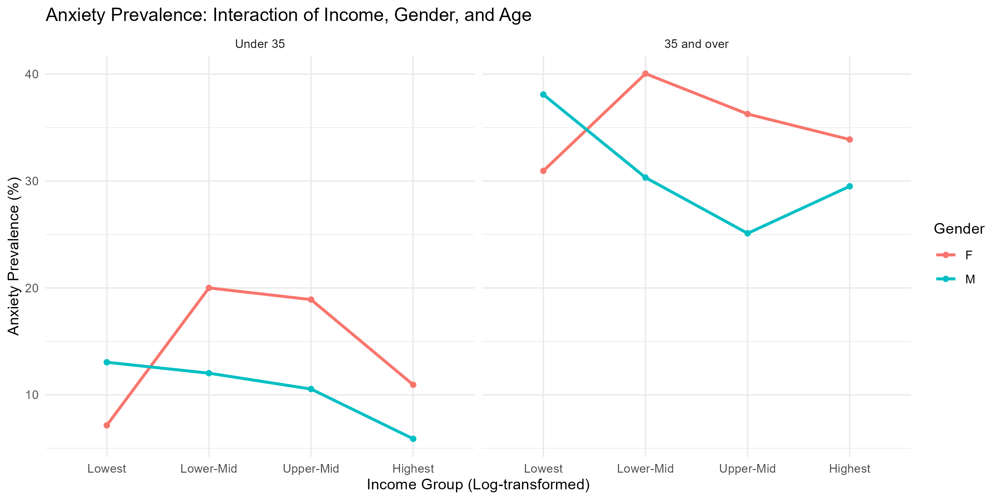

## Key Findings & Discussion

### Condition Prevalence by Income Group

### Anxiety Prevalence by Income, Gender and Age Group

### Statistical Results
| Model | Variable | OR | 95% CI | Significant? |
|---|---|---|---|---|
| Addiction (35+) | Income (log) | 0.85 | [0.80-0.91] | ✅ Yes |
| Addiction (35+) | Gender (Male) | 1.16 | [1.00-1.34] | ✅ Yes |
| Anxiety (all) | Gender (Male) | 0.62 | [0.54-0.71] | ✅ Yes |
| Anxiety (all) | Age 35+ | 2.84 | [2.40-3.36] | ✅ Yes |

### Main Findings
1. **Addiction rises sharply with age** for both genders — from ~31% in under 35 
   to ~56% in adults 35 and over
2. **Higher income protects against addiction** (OR = 0.85, CI [0.80-0.91]), 
   but only in adults 35 and over
3. **Women are significantly more anxious** than men at all ages 
   (OR = 0.62 for males, CI [0.54-0.71])
4. **Anxiety nearly triples after age 35** (OR = 2.84, CI [2.40-3.36])
5. **Income is not associated with anxiety** in any age group or gender

### Interpretation
The socioeconomic gradient in addiction only emerges after age 35, suggesting 
that cumulative economic disadvantage over time — rather than current income 
alone — may drive substance use disorders. Gender differences in anxiety are 
consistent across age groups and independent of income. Women are more likely 
to suffer from anxiety regardless of income than men, moreso in the older age group.