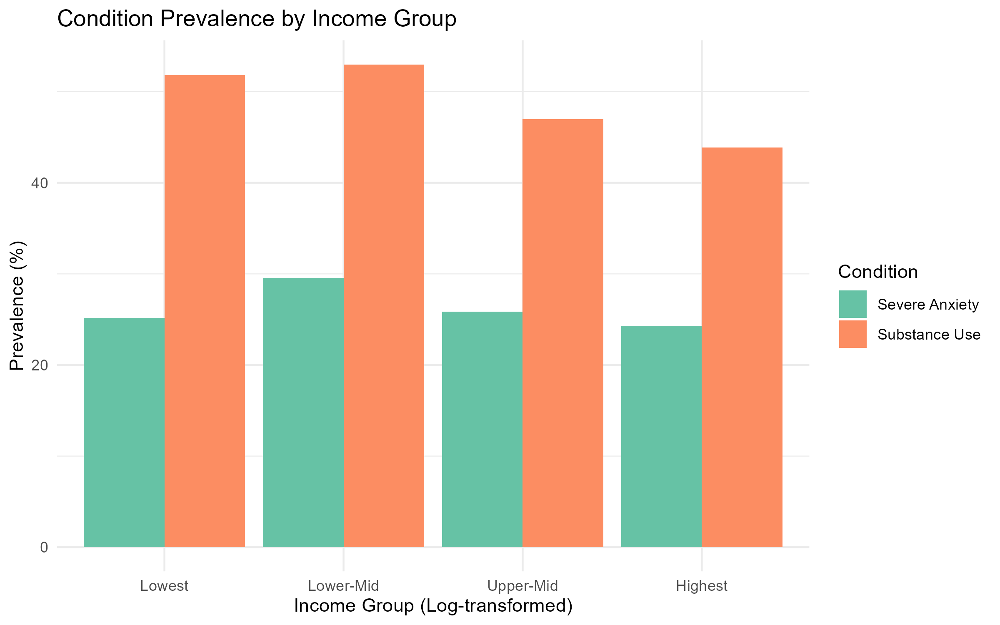

# Anxiety and Addiction in US Adults: Associations with Income, Age and Gender

## Authors
- Alma
- Roshinie

## Course
STA220 — Data Project

> **Note:** This report was generated using synthetic data! It is only used for 
> demonstration purposes and does not reflect real patients or healthcare providers.

---

## Table of Contents
1. Executive Summary
2. Introduction
3. Data Overview
4. Analysis Plan
5. Key Findings & Discussion
6. Limitations

---

## Executive Summary
This project examines the relationship between household income and the prevalence 
of severe anxiety and substance use disorders in a US patient population, stratified 
by age group (under 35 vs 35 and over) and gender.

**Research Questions:**
- Is income associated with the prevalence of severe anxiety?
- Is income associated with substance use disorders (alcohol, drugs, opioids)?
- Do these associations differ between younger and older adults, between female and male?

---

## Introduction
Mental health disorders and substance use disorders are major public health challenges. 
Social and economic factors — particularly income — may play a significant role in 
both the development and treatment of these conditions. Income is widely used in 
epidemiological research as a proxy for socioeconomic status, reflecting access to 
resources, living conditions, and overall quality of life. We therefore focus on 
income as our primary socioeconomic indicator to explore its association with anxiety 
and addiction in this patient population, while controlling for age and gender.

---

## Data Overview
This project uses the following datasets from the STA220 course (synthetic US health data):

| Dataset | Description |
|---|---|
| `patients.csv` | Demographic and socioeconomic data including income |
| `conditions.csv` | Patient diagnoses including anxiety and addiction disorders |

**Condition codes used (SNOMED):**
| Condition | Code |
|---|---|
| Severe anxiety | 80583007 |
| Dependent drug abuse | 6525002 |
| Unhealthy alcohol drinking | 10939881000119104 |
| Misuses drugs | 361055000 |
| Opioid abuse | 5602001 |
| Alcoholism | 7200002 |

---

## Analysis Plan
1. Load and clean patient and condition data
2. Remove deceased patients, impossible ages, and extreme income outliers
3. Create binary indicators for anxiety and addiction per patient using SNOMED codes
4. Log-transform income to address right-skewed distribution
5. Split population into two age groups: under 35 and 35 and over
6. Descriptive analysis: prevalence by age group and gender
7. Logistic regression models with income and gender as predictors
8. Visualizations: bar charts and line plots

---

## Key Findings & Discussion

### Condition Prevalence by Income Group


### Statistical Results
| Model | Variable | OR | 95% CI | Significant? |
|---|---|---|---|---|
| Addiction (35+) | Income (log) | 0.85 | [0.80-0.91] | ✅ Yes |
| Addiction (35+) | Gender (Male) | 1.16 | [1.00-1.34] | ✅ Yes |
| Anxiety (all) | Gender (Male) | 0.62 | [0.54-0.71] | ✅ Yes |
| Anxiety (all) | Age 35+ | 2.84 | [2.40-3.36] | ✅ Yes |

### Main Findings
1. **Addiction rises sharply with age** for both genders — from ~31% in under 35 
   to ~56% in adults 35 and over
2. **Higher income protects against addiction** (OR = 0.85, CI [0.80-0.91]), 
   but only in adults 35 and over
3. **Women are significantly more anxious** than men at all ages 
   (OR = 0.62 for males, CI [0.54-0.71])
4. **Anxiety nearly triples after age 35** (OR = 2.84, CI [2.40-3.36])
5. **Income is not associated with anxiety** in any age group or gender

### Interpretation
The socioeconomic gradient in addiction only emerges after age 35, suggesting 
that cumulative economic disadvantage over time — rather than current income 
alone — may drive substance use disorders. Gender differences in anxiety are 
consistent across age groups and independent of income. Women are more likely 
to suffer from anxiety regardless of income than men, moreso in the older age group.

---

## Limitations
- This analysis shows associations but cannot establish causal relationships
- Results are based on synthetic data and may not reflect real-world patterns
- Age was calculated using 2024 as reference year — the exact data extraction 
  date is unknown
- Other confounding variables not captured in the dataset may influence results, 
  such as history of trauma, social isolation, or employment status, which may 
  have an equal or greater effect on anxiety and addiction than income alone
- Income was log-transformed to handle skewness but a small number of very low 
  income values remain in the data

---

## Reproducibility
This project uses a `{targets}` pipeline. To reproduce the analysis, run:
```r
targets::tar_make()
```

## Repository Structure
```
R/              # Analysis scripts and functions
_targets.R      # Workflow pipeline
docs/           # Quarto presentation
figures/        # Generated plots
README.md       # Project description
```